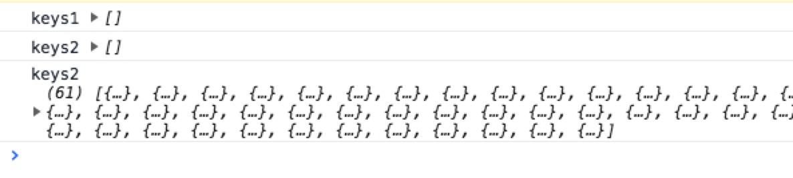

# react-native github经典项目

# 遇到的问题，
* 环境配置问题 [url]
* redux languages action await异步回调数据，即便页面TrendingPage  onLoadLanguage(FLAG_LANGUAGE.flag_language); 派发action之后，仍然拿不到数据，只有等到组件渲染完成才拿到。。
  
  通过观察,await异步申请的本地AsyncStorage数据，会存在请求不到的情况， 解决，判断keys
  
  
  
  ``` javascript
  //action 
  import Types from '../types'
  
  import LanguageDao from "../../expand/dao/LanguageDao"
  
  export function onLoadLanguage(flagKey) {
      return async dispatch=>{
          try {
              let languages = await new LanguageDao(flagKey).fetch();
              dispatch({
                  type:Types.LANGUAGE_LOAD_SUCCESS,
                  languages:languages,
                  flag:flagKey
              })
          }catch (e) {
              console.log(e)
          }
      }
  }
  
  //TrendingPage
  class TrendingPage extends Component<Props> {
    
     render(){
        const TabNavigator = keys.length?createAppContainer(createMaterialTopTabNavigator(
            this._genTabs(), {
                //设置tab样式。..
            }
        )):null;
      }
     
  }
  const mapTrendingStateToProps = function(state){
      return {
          keys: state.language.languages,
          theme: state.theme.theme,
      };
  }
  ```
* 使用NavigationUtil页面无法进入DetailPage 
 ``` javascript
    //TrendingPage.js 
    import NavigationUtil from '../navigator/NavigationUtil'
    //......
   
    renderItem(data){
        const item = data.item;
        const {theme} = this.props;
        const {navigation} = this.props;
        NavigationUtil.navigation = this.props.navigation; 
          //此处NavigationUtil再次被覆盖，NavigationUtil类的 navigation对象出现异常。
          //正确使用方法在HomePage入口处一次配置，全部生效
        return <TrendingItem
            projectModel={item}
            theme={theme}
            onSelect={(callback)=>{
                console.log('cccc');
                NavigationUtil.goPage({
                    theme,
                    projectMode:item,
                    flag:FLAG_STORAGE.flag_trending,
                    callback,
                },'DetailPage')

            }}
            onFavorite={(item, isFavorite) => FavoriteUtil.onFavorite(favoriteDao, item, isFavorite, FLAG_STORAGE.flag_trending)}
            />
    }
    ```